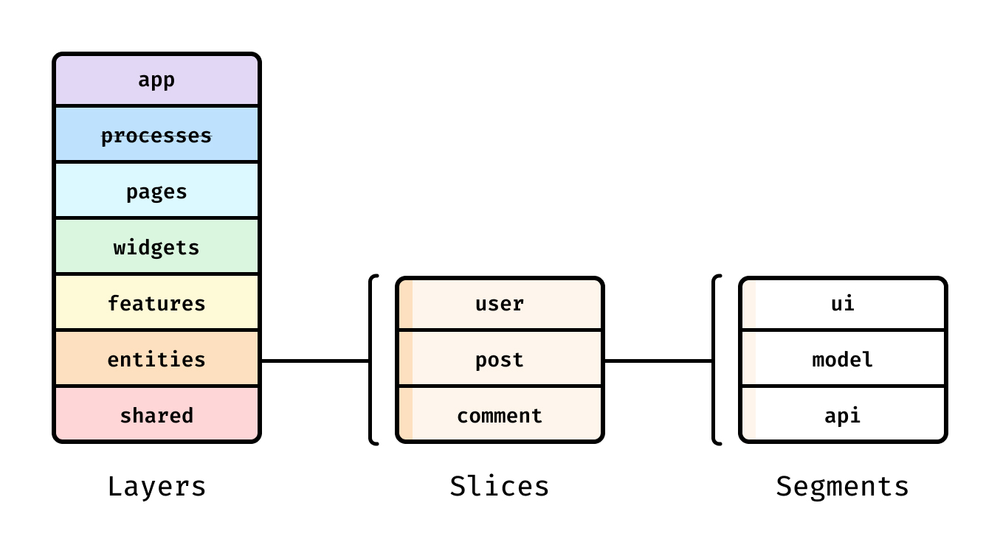

# Frontend для умного бюджета

Этот проект реализован на основе Feature-Sliced Design с использованием библиотеки React.

Фото начальной страницы

## Описание проекта

Проект разделён на слои, части и сегменты в соответствии с методологией Feature-Sliced Design, тем самым обеспечивая высокую гибкость и расширяемость.


## Используемые технолоогии

 - TypeScript
 - MobX (пока под вопросом)
 - axios

## Запуск

Для локального запуска необходимо склонировать проект
```
git clone 
```
Затем в самом проекте подтянуть зависимости
```
npm install
```
И после всех действий запустить
```
npm start
```